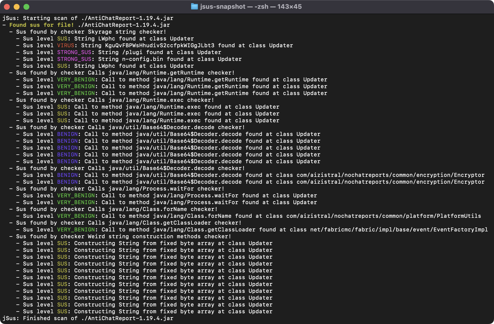

# jSus

    

WIP Java / Minecraft focused malware false positive generator.

In general, the point of this project is to flag potentially suspicious behaviour in a program, even if it's for completely innocent reasons.

Code is largely unfinished and is of bad quality. Please also use a real detector, like [jNeedle](https://github.com/KosmX/jneedle), [nekodetector](https://github.com/MCRcortex/nekodetector), or the [Overwolf tools](https://support.curseforge.com/en/support/solutions/articles/9000228509-june-2023-infected-mods-detection-tool/)!
